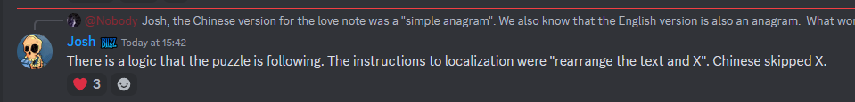
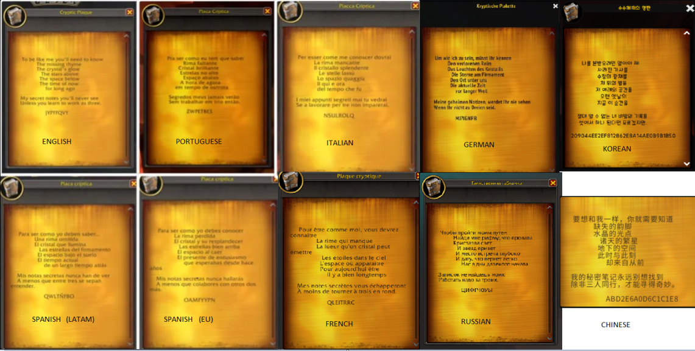

# 1 o'clock: Love

This script is an **attempt** at a decoder for the first puzzle. It's missing something....




```
python .\button.py

Interrupts: 4 20 20       Plaintext: WABI
Interrupts: 8 18 19       Plaintext: AYAH
Interrupts: 10 14 20      Plaintext: CUBI
Interrupts: 11 20 20      Plaintext: DABB
Interrupts: 13 20 12      Plaintext: FATH
Interrupts: 13 20 15      Plaintext: FAWE
Interrupts: 14 8 19       Plaintext: GOAF
Interrupts: 14 20 11      Plaintext: GASH
Interrupts: 14 20 14      Plaintext: GAVE
Interrupts: 14 20 20      Plaintext: GABY
Interrupts: 15 20 17      Plaintext: HAYA
Interrupts: 18 14 20      Plaintext: KUBA
Interrupts: 18 18 12      Plaintext: KYTE
Interrupts: 18 20 14      Plaintext: KAVA
Interrupts: 19 18 11      Plaintext: LYSE
Interrupts: 19 20 10      Plaintext: LARD
Interrupts: 20 14 11      Plaintext: MUSH
Interrupts: 20 20 4       Plaintext: MALI
Interrupts: 20 20 6       Plaintext: MANG
Interrupts: 20 20 10      Plaintext: MARC
Interrupts: 20 20 19      Plaintext: MAAT
Interrupts: 13 18 15 18   Plaintext: RAJAB
Interrupts: 15 18 19 17   Plaintext: TANZY
Interrupts: 20 20 19      Plaintext: MAAT
Interrupts: 13 18 15 18   Plaintext: RAJAB
Interrupts: 15 18 19 17   Plaintext: TANZY
Interrupts: 6 19          Plaintext: GUV
Interrupts: 20 20 19      Plaintext: MAAT
Interrupts: 13 18 15 18   Plaintext: RAJAB
Interrupts: 15 18 19 17   Plaintext: TANZY
Interrupts: 6 19          Plaintext: GUV
Interrupts: 9 13          Plaintext: JOW
Interrupts: 9 19          Plaintext: JUS
Interrupts: 10 16         Plaintext: KRU
Interrupts: 11 13         Plaintext: LOW
Interrupts: 11 18         Plaintext: LTR
Interrupts: 12 16         Plaintext: MRS
Interrupts: 13 13         Plaintext: NOU
Interrupts: 14 13         Plaintext: OOT
Interrupts: 14 14         Plaintext: OPS
Interrupts: 14 18         Plaintext: OTO
Interrupts: 15 13         Plaintext: POS
Interrupts: 9 13          Plaintext: JOW
Interrupts: 9 19          Plaintext: JUS
Interrupts: 10 16         Plaintext: KRU
Interrupts: 11 13         Plaintext: LOW
Interrupts: 11 18         Plaintext: LTR
Interrupts: 12 16         Plaintext: MRS
Interrupts: 13 13         Plaintext: NOU
Interrupts: 14 13         Plaintext: OOT
Interrupts: 14 14         Plaintext: OPS
Interrupts: 14 18         Plaintext: OTO
Interrupts: 15 13         Plaintext: POS
Interrupts: 13 13         Plaintext: NOU
Interrupts: 14 13         Plaintext: OOT
Interrupts: 14 14         Plaintext: OPS
Interrupts: 14 18         Plaintext: OTO
Interrupts: 15 13         Plaintext: POS
Interrupts: 15 14         Plaintext: PPR
Interrupts: 15 16         Plaintext: PRP
Interrupts: 17 11         Plaintext: RMS
Interrupts: 18 13         Plaintext: SOP
Interrupts: 18 18         Plaintext: STK
Interrupts: 18 13         Plaintext: SOP
Interrupts: 18 18         Plaintext: STK
Interrupts: 19 3          Plaintext: TEW
Interrupts: 19 7          Plaintext: TIU
Interrupts: 19 10         Plaintext: TLR
Interrupts: 19 13         Plaintext: TOO
Interrupts: 19 17         Plaintext: TSK
Interrupts: 19 19         Plaintext: TUI
Interrupts: 20 7          Plaintext: UIT
Interrupts: 20 11         Plaintext: UMP
Interrupts: 20 18         Plaintext: UTI
```

## Where to now?

Not sure where to go from here. 

> SGHO EIUII ABD MOO NK GHN, EDNY, DL LLSE
> 
> It was originally solved in Chinese, and backwards translated to "Undying orc love lights up body, mind, and soul".

I suppose the structure will be similar to the translation. Word length is a concern but could be the translation. 


